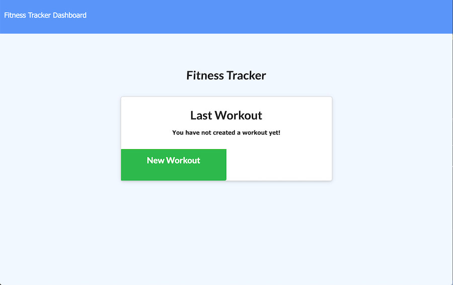

# Fitness Tracker

  ## Table of Content
  -[Description](#description)
  -[Technologies](#technologies)
  -[Usage](#usage)
  -[DEMO](#demo)

## Description
The following application is a workout tracker that lets users view, create and track daily workouts. User's are able to log multiple exercises in a workout on a given day and track the name, type, weight, sets, reps, and duration of exercise. If the exercise is a cardio exercise, the user is able to track the distance traveled. Finally, the user is able to view the combined weight of multiple exercises on the `stats` page.

## Technologies
This application uses the following: Node.js, require, express, mongoDB, mongoose, and module exports.

## Usage
Deployed using Heroku

## Demo
